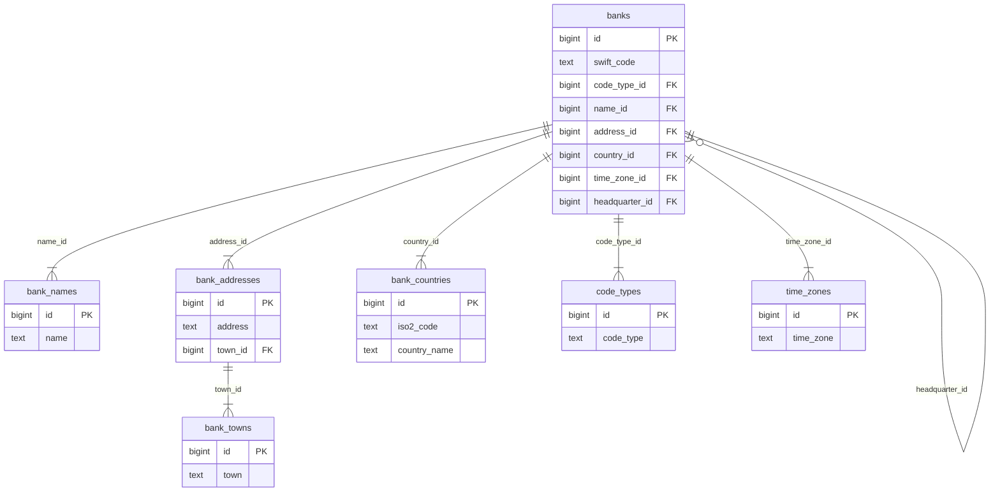

# Project SWIFT-Task

A SWIFT code, also known as a Bank Identifier Code (BIC), is a unique identifier of a bank's branch or headquarter.
It ensures that international wire transfers are directed to the correct bank and branch, acting as a bank's unique
address within the global financial network.

## Project Description

Develop an application for storing bank data, with support for data import via CSV files. The application should also
expose an API for managing the stored data.
For a detailed task description, refer to [SWIFT-Task.pdf](SWIFT-Task.pdf).

## Prerequisites

- [Go](https://golang.org/doc/install)
- [Docker](https://docs.docker.com/get-docker/)
- [Docker Compose](https://docs.docker.com/compose/install/)
- [PostgreSQL](https://www.postgresql.org/download/)

## Solution

The application for storing secrets uses a `.env` file, which should be placed in the root directory of the project.
An example file might look like this:

```
PORT=<port>
POSTGRES_DB_HOST=<host>
POSTGRES_DB_PORT=<port>
POSTGRES_DB=<database>
POSTGRES_USER=<username>
POSTGRES_PASSWORD=<password>
POSTGRES_DB_SCHEMA=<schema>
CSV_FILE_NAME=<file_name>
```

### Data import

After starting the application read banks data from the CSV file provided from `CSV_FILE_NAME` and store it in the
database. To provide new data, put the CSV file in the `csv-data/` directory and change to `CSV_FILE_NAME` variable.

To correctly parse data, CSV file needs to have the following columns:

- `ADDRESS`
- `NAME`
- `COUNTRY ISO2 CODE`
- `COUNTRY NAME`
- `SWIFT CODE`
- `CODE TYPE`
- `TOWN NAME`
- `TIME ZONE`

The system imposes strict requirements on the data imported into the database. Data provided in an incorrect format will
be rejected.

Data requirements:

- The SWIFT code must consist of 11 characters.
- The SWIFT code must be unique.
- The SWIFT code must be uppercased.
- The ISO2 code must consist of 2 characters.
- The ISO2 code must be uppercased.
- The country name cannot be empty.
- The country name must be uppercased.
- The bank name cannot be empty.

### Database

PostgreSQL was used to store data about banks. To avoid data duplication, the data was divided into several tables, as
presented below.



### API

After starting the application, the following endpoints are available:

#### GET: `/v1/swift-codes/{swift-code}`

Retrieve details of a single SWIFT code, whether for a headquarters or branches.

#### GET: `/v1/swift-codes/country/{countryISO2code`}

Return all SWIFT codes with details for a specific country (both headquarters and branches).

#### POST: `/v1/swift-codes`

Add new SWIFT code entries to the database for a specific country.
Example body:
`
`

#### DELETE: `/v1/swift-codes/{swift-code}`

Delete SWIFT code data if the provided SWIFT code matches one in the database.

Each endpoint either returns the requested data, a message indicating the operation was successful, or an error message.

Example error for `POST: /v1/swift-codes` with a body like this:

```json
{
  "address": "Main St",
  "bankName": null,
  "countryISO2": "s",
  "countryName": "test",
  "isHeadquarter": true,
  "swiftCode": "AAQAAQQAXXA"
}
```

The response might look like this:

```json
{
  "success": false,
  "status": 400,
  "message": "Request invalid",
  "details": [
    "ISO2 code must be 2 characters long",
    "ISO2 code must be in uppercase",
    "Country name must be in uppercase",
    "Name cannot be empty",
    "Headquarter status does not match SWIFT code"
  ]
}
```

For a correct request like this:

```json
{
  "address": "Main St",
  "bankName": "Test Bank",
  "countryISO2": "PL",
  "countryName": "POLAND",
  "isHeadquarter": true,
  "swiftCode": "AAQAAQQAXXX"
}
```

The response might look like this:

```json
{
  "success": true,
  "status": 201,
  "message": "Bank data added successfully"
}
```

## Running the application

Easiest way to run the application is to use the provided Makefile and use Docker:

Start app in Docker:

```bash
make docker-run
```

Stop app in Docker:

```bash
make docker-down
```

There is also a way to run the application without Docker, but it requires a running PostgreSQL instance.

```bash
make run
```

Easiest way to set up PostgreSQL database local is to use Docker. Run the following commands in root directory of the
project:

```bash
docker pull postgres:15-alpine
docker run --name swift-task-db -p 5432:5432 --env-file .env -d postgres:15-alpine
```
To stop the database, run:

```bash
docker stop swift-task-db
```

To run tests, you can use the following commands:

```bash
make test
```


